# LAB: Playing with Git in Local Environment
- __Time required:__ 15 minutes
- __Pre-requisities:__ Should have Git & VS Code installed, basic understanding of Git terminologies
- __Difficulty level:__ Begineer
- __Objectives:__
    - To get familiar with terms related to Git,
    - To get introduced to how Git works,
    - To visualize and get used to Git workflows,
    - To be familiar with CLI environment and Git commands.

## Summary
In this lab, we wil be dealing with a scenario where we will be writing a short essay on any topic you would like. Note that: we will not be dealing with how to write a good essay but we will be focusing on how to use Git as VCS in your project.

### Scenario
You are a famous content writer of Nepal and you are planning to work on a new project about __"WONDER OF COMPUTERS"__. So, you planned that your folder hierarchy must look something like below;
```
.
├── author.md
├── story.md
└── rough_plans
```
Here,
- `author.md` file will store information about you (the author),
- `story.md` file will store the content of your story,
- `rough_plans` file will contain rough sketch of your plans and ideas that will come in your mind.

So, lets start our lab.

### 1. Initializing a Git Repo
Let's start by creating your own Git repository for the project. 
> A repository is the root folder for your project i.e. it is the main folder where you will be working for that project. 
Below are the steps that you need to follow;

#### 1. Create a folder named `wonder_of_computers` anywhere you like.
This folder will contain all the content that was mentioned above.

#### 2. Open the folder in VS Code.
- To do this open VS code in your computer. You may see something like this;<br>
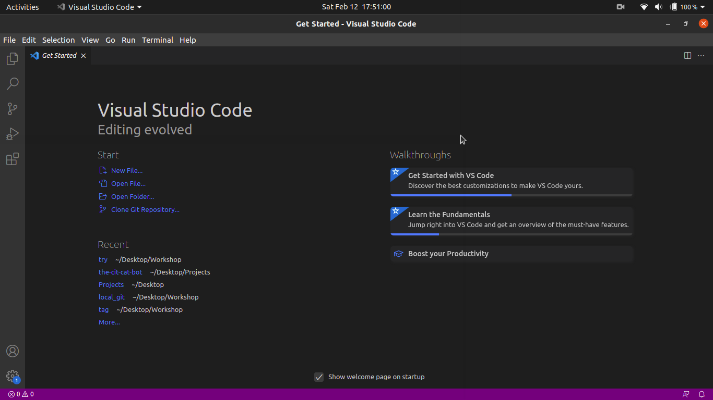
- Click on Top-left `File` option and select `Open Folder` option from the dropdown.
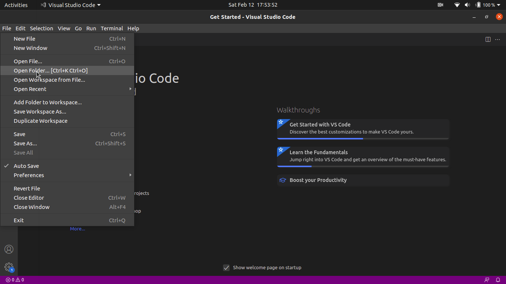
- Select the folder which you had created in STEP 1, and click open.
- Now you will see something like this; <br>
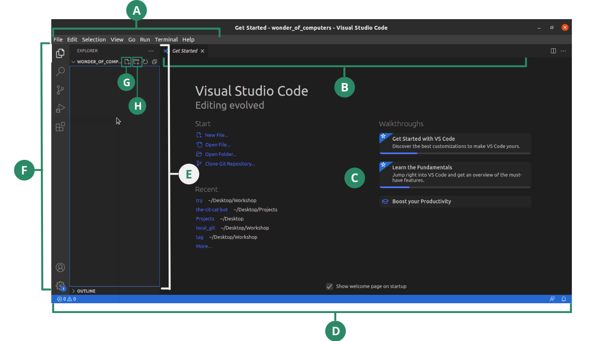
    - (A) __MenuBar__, contains options and menus for different operations, 
    - (B) __Editor Groups__, contains all the recently opened files,
    - (C) __Editor__, is the area where you edit your file, 
    - (D) __Status bar__, contains the status of your file. Eg, line number, repo info, etc.,
    - (E) __Side bar__, contains options like Explorer which is used to explore the files and folders inside the root directory, 
    - (F) __Activity bar__, contains options like Explorer, Search, Source Control, Extensions etc.
    - (G) __New file icon__, is used to create a new file,
    - (H) __New folder icon__, is used to create a new folder.

Note that: New folder and New file is created inside the folder which is being highlighted.

#### 3. Open the terminal
- Go To `Terminal` in Menubar and click on `New Terminal` option from the dropdown,
- A new terminal panel appears as shown below;
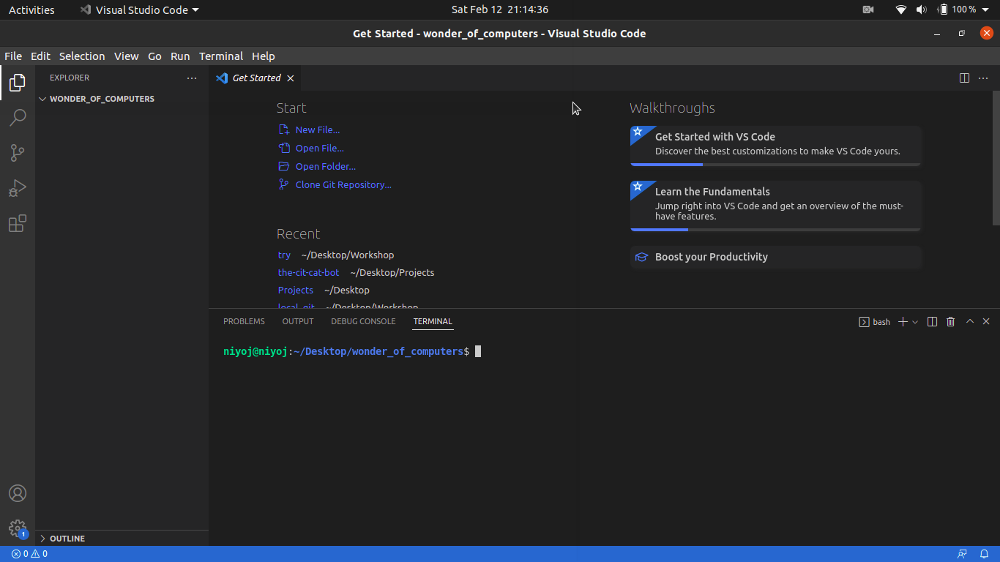
- You can use commands to interact with your OS from the terminal without ever need to exiting the VS Code.
- Try using the command
```
echo "Hello Terminal"
```

#### 4. Use command git init to initalize a empty Git repository
- Now click on your terminal and type the command
```bash
git init
```
- This command will initialize a empty repository in the current directory. That means now the folder `wonder_of_computers` is a Git repository.
- You can notice that a folder named `.git` has been created which holds all the information to be stored by Git.

### 2. Giving Yourself a Identity
- Git needs your information like your name and email address which are to be displayed when you commit any changes.
- To give yourself identity you can use the code;
```bash
git config --global user.name "<Your Name Here>"
git config --global user.email "<Your Email Here>"
```
for adding your name and email as configurations in Git.
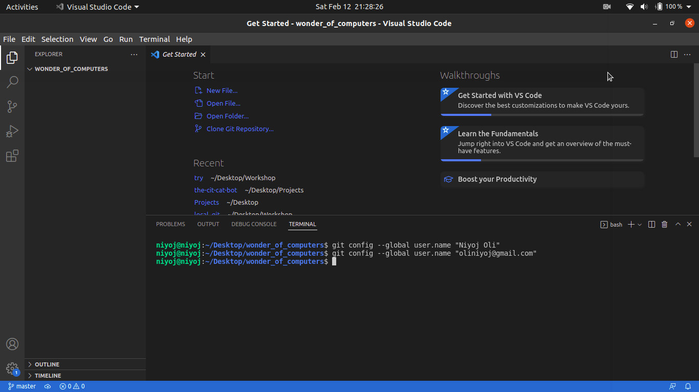
- Note that the above command will remember you with the same name and email address in every repo that you create in your system.
- If you want a different identity for this repo only, you can use the command,
```bash
git config --local user.name "<Your Name Here>"
git config --local user.email "<Your Email Here>"
```
- Now every time you commit, your identity will be the name and email address that you provided here.
- To check if everything is alright or not you can use the command;
```bash
git config --list
```
and see all the configurations you have made.
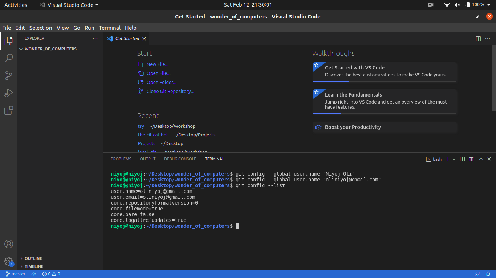

### 3. Creating Your First Commit
First, let us create file and folder structure for our project.
- Click on `new file icon` (as shown in the picture below), and type the name of the file `author.md` and hit enter. You will see a new file named `author.md` will be created and displayed in the File Explorer Panel.
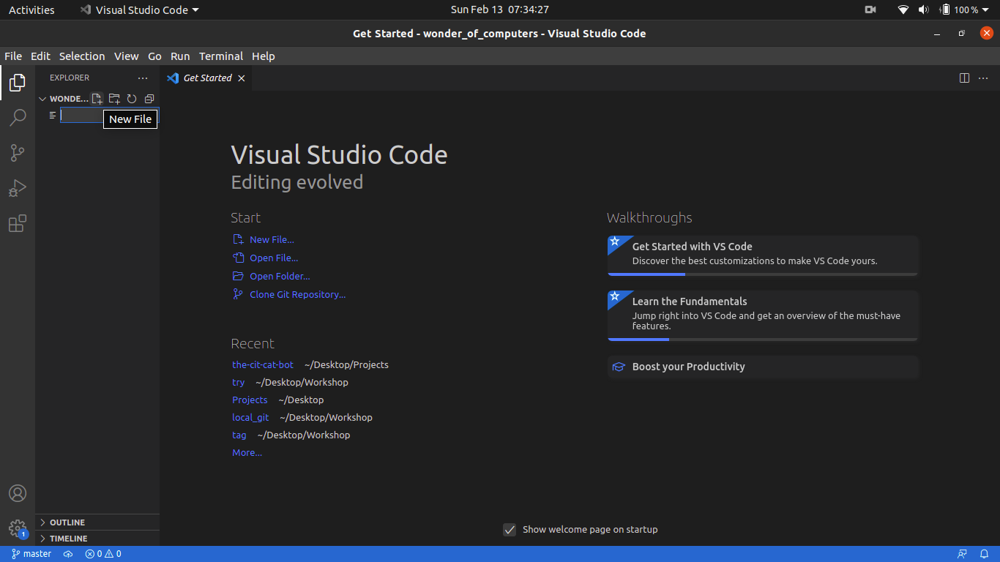
- Again create a new file named `story.md` and yahoo you learned how to create files and folders in VS code.
- You may something like this;

- Did you notics small U symbol at the end of name of file, it means the files are currently `untracked files`. In Git, we must give instruction to Git to track a file so that, it can record the changes of the particular files.
- Now, open the terminal by going to `Terminal` option on the menubar and selecting `New Terminal`. A new terminal panel would open at the bottom.
- Use the command `git status` to check the status of your repository. You may see something like this in your terminal;
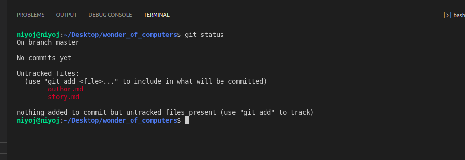
which shows there are two new files in the repo, and both of them are untracked files.
> In Git there are two types of files in general; tracked files and untracked files. Untracked files are those files whose changes are not being recorded by Git while Tracked files are those files whose changes are being monitored by Git.

<br><br>Let's see the workflow of Git to know our next steps;

<br>So, to track the files we must use the command `git add <filename>` which will tell Git to start tracking the file and also stages the file.
> Staging area is the place where you select and place the changes you want to be in your next commit. To stage any file we use the command `git add <filename>`.
- Now goto your terminal again and type the following command;
```bash
git add story.md
git status
```
- We now have staged our `story.md` files but not `author.md` file so looking at the status we can see;
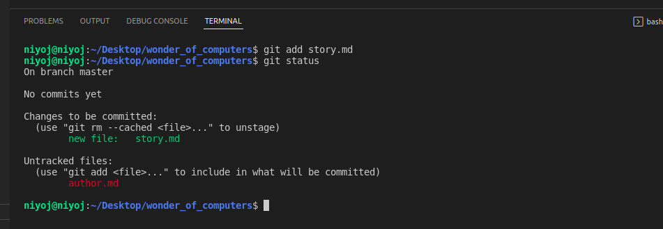
Where you can see, `story.md` file has reached staging area and it will appear in next commit while file `author.md` is still an untracked file.
<br>And did you notice the `U` symbol has changed to `A` for the `story.md` filename. This denotes that your file `story.md` has been added to the index or staging area.
> Staging area is also called Index.
- Now let's use the command
```bash
git add author.md
git status
```
and stage the `author.md` file and check the new status of our repo. You may see both of the files has reached in our staging area and are ready to be committed.
- To commit the file, you can use the command;
```bash
git commit -m "creates folder structure"
```
in the terminal. And again check the status of your repo with the command `git status`. You may see some message that says
```
On branch master
nothing to commit, working tree clean
```
which means every changes you made in the working directory has been saved to the local repository so, your working directory is clean.
- Now, to see the commit history you can use the command
```bash
git log
```
on terminal which prints the output as;
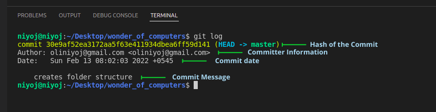
Which have following parts;
    - Hash of the commit which is the unique identification number of each commit,
    - Committer information which we have created when setting up our identity,
    - Commit date and time,
    - Commit message which is the message we used while creating the commit.
- You can use the command
```bash
git log --patch
```
to see the changes made with the commit history.
> To see the changes made with the last nth commit we can use command `git log --patch -n`. E.g. `git log --patch -2` shows the changes made in last two commit.

### 4. Understanding Concept of Staging Area
Now, let's work up in our project and introduce yourself in `author.md` file. 
- Click on file named `author.md` in the file explorer panel,
- Then add the content as below in file `author.md`.
```
Hello, I am <YOUR NAME here>. <AND TELL LITTLE ABOUT YOURSELF HERE>
```
Your project might look something like;
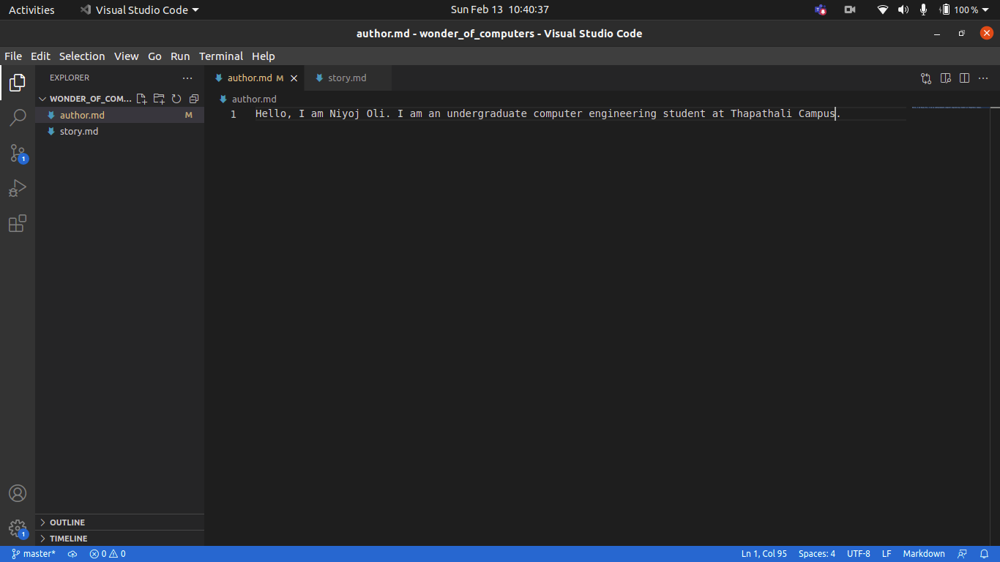
<br>
As soon as you are done you will see a `M` symbol at side of the file name `author.md` in the file explorer panel. The M stands for Modified file.
<br><br>
- Now, again lets start the plot for our story. Add the following text in the file `story.md`.
```
Computer is a electronic machine that takes input, analyzes it and gives us some meaningful result. The wonders of computers is actually very huge. Some of wonders are
```
- After this you will see a M symbol on `story.md` too. And now let's check status of our repo by use of command `git status`. You will see something like below;
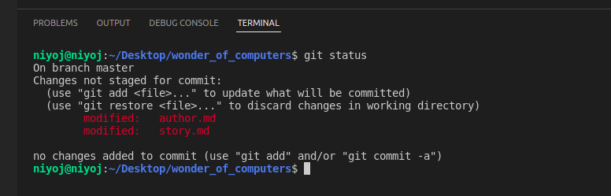
Here you can see that both the files have been modified but changes are not yet staged. Also, from the content of the files you can guess file `author.md` is completed to some extent but the file `story.md` is incomplete. So, let's commit in such a way that the changes of `author.md` only appears in the commit while the changes made in `story.md` will appear in next commit after it is also completed.
- Since, commit captures the changes of staging area only, the above problem can be solved easily by staging `author.md` only which can be done by the command;
```
git add author.md
git status -s
```
This staged the file `author.md` only. Also, we have use a new option for the command `git status`. The `-s` stands for short. So, command `git status -s` displays the status of our repo in very short which you can see below;
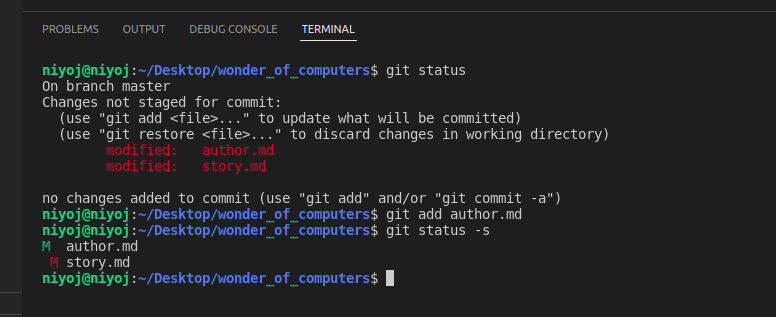
Here, the green M means the file has been modified since last commit but the changes has been staged. But the red M means the file has been modified but the changes has not been staged yet.
> The command `git status -s` is used to display the status of the repo in very short.
> The symbol U => Untracked file, A => Added to the Index (Staging Area), green M => Modified but staged file, red M => Modified but not staged file.
- Now let's commit with the command;
```bash
git commit -m "completes basic introduction of author"
```
and let's see what changes where stored in the commit that we just did. For this you can use the command 
```
git log --patch -1
```
and you may see something like;
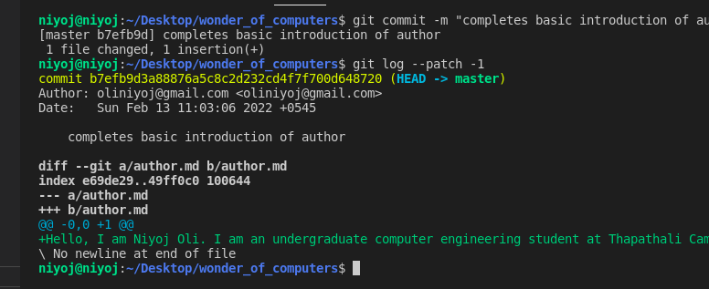
which gives us information that only `author.md` changes have been committed.
- Also you can again check the status of the repo and see that the working tree is not clean there is still changes in `story.md` file which needs to be staged.

```
SUMMARY TILL NOW

1. You can initialize a Git repo with the command, git init
2. You can give yourself a identity by the commands,
    
    git config --<level> user.name "<YOUR NAME HERE>"
    git config --<level> user.email "<YOUR EMAIL HERE>"

    Where <level> can be;
        - global : which makes configuration for every repo we create in our PC,
        - local : which makes configuration only for the repo we are currently on. 

3. You can check the status of the repo by command, git status 
4. You can check the status of the repo in short by command, git status -s
5. You can track an untracked file or stage a modified file by command, git add <filename>
6. The changes that have been staged only appears in the next commit.
7. You can commit with command, git commit -m "<YOUR COMMIT MESSAGE HERE>"
7. You can check the commit history with command, git log
8. You can see the changes made in each commit by the command, git log --patch
```

### 5. Using .gitignore File
- Now, let' add the follwing content in `story.md` file;
```
 doing tasks taking hours in just couple of milliseconds.
```
and also add the following content in `author.md` file;
```
I am a content writer and I am writing some content on Wonders of Computers.
``` 
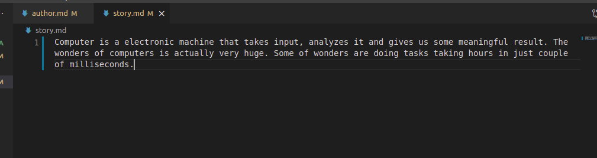
- and let's check the status of our repo by command `git status -s` which shows both files have been modified and changes are yet to be staged.
- To stage the changes we can use the command;
```
git add author.md
git add story.md
```
But what if there were 100 such files individually staging a file is not a good practice. So, we have a command
```
git add .
```
that automatically stages and tracks every file on the repository.
- Let's use this command `git add .` and see the status of our repository.
- We can see that all the changes have been staged.
> `git add .` command is used to stage and track all the files in the repository.
<br><br>

- Now, let's create a file named `rough_plans` where we will write every plans in rough for the project. And we do not need this file to appear in any commit.
- Use the command `git add .` to stage all the changes. 
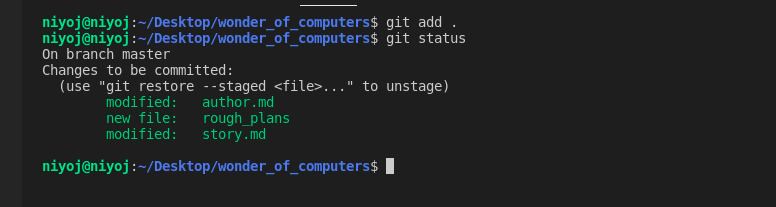
But you will notice `rough_plans` also have been added to the index which we don't want. So, let's see what we can do.
- Use the command;
```
git restore --staged rough_plans
```
to unstage the file `rough_plans` so, it will be an untracked file once again. Use the command `git status` to see the status of your repository.
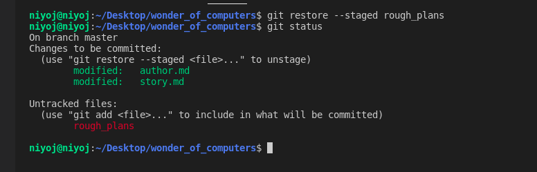
- If we want to ignore some files like rough files, files with passwords, system generated files, etc. we can use a feature in Git called `gitignore`.
- To use this create a file named `.gitignore`. This file gives information about which files are to be ignored by the Git.
- Let's see what we can do with the file `.gitignore` add the following content on the file `.gitignore`;
```
# Any line starting with # is a comment

# ignoring fie rough_plans
rough_plans
```
Here, any line starting with # is comment and any file name written is automatically ignored i.e. it will not be staged and tracked automatically.
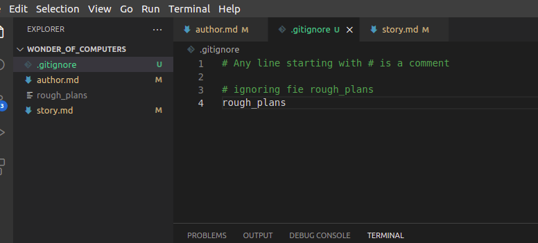
- Now try the command `git add .` followed by `git status` command.
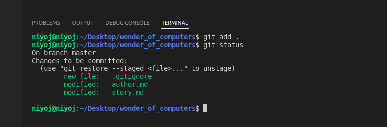
You can see that the file `rough_plans` has not been staged or tracked despite we used the command `git add .`. You can't even see `rough_plans` in git status output. It is so, because it is being ignore by Git.
- Now let's commit the changes we have done with command;
```
git commit -m "completes strry and author information"
```

> Tips: You can use the command `git commit -a -m "<YOUR MESSAGE HERE>"` to skip the staging area. This command is equivalent to `git add .` and `git commit -m "<YOUR MESSAGE HERE>"`.

### 6. Undoing Things
You might have noticed earlier we typed some mistakes in our commit message and now we need to correct it. 
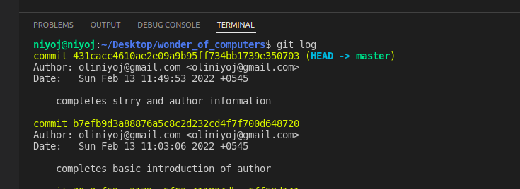
- To correct the last commit message we can use the command;
```
git commit --amend -m "completed story and author info"
```
This will replace previous commit message with this new commit message.
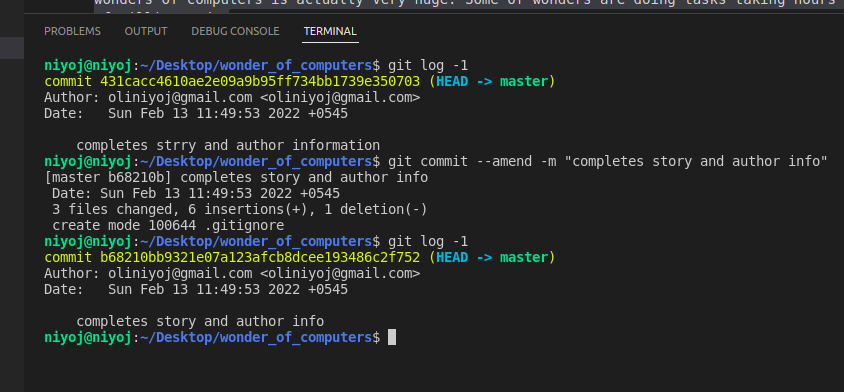
Here the `--amend` option means ammend the last commit.
- Suppose you want to add some lines in `author.md` but do not want to create new commit message i.e. you want to amend the content on previous commit. First add the below content to file `author.md`;
```
This essay is like a freelancing project for me. I am practicing Git while writing this content.
```
and stage the changes made by command `git add author.md`.
- Now you can use the command;
```
git commit --amend --no-edit
```
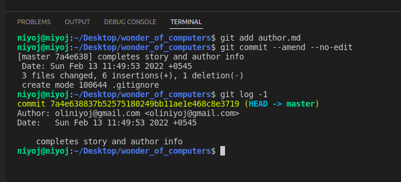

> Note that: you could have use command `git commit --amend -m "<new commit message>" above to add content plus change the commit message at same time.

### 7. Git Tags
- Now, let's assume we have completed version 1 of our project. Then how can we know which commit was the checkpoint of Version1 among all commits?

So, we use tags to create a checkpoint for commit.
- To tag the last commit we can use the command;
```
git tag -a "V1.0" -m "Version 1 of Project was completed"
```
and use the command `git log` to see the effect.
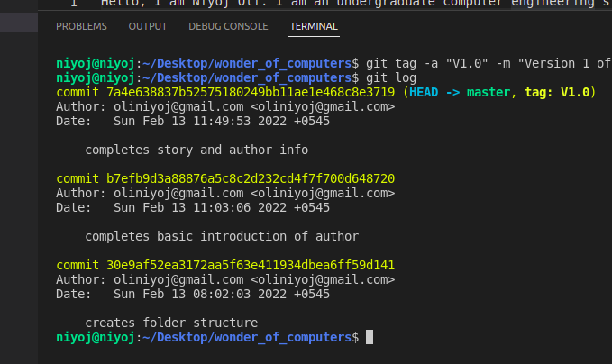
You may notice that `tag V1.0` has appeared in the commit hash which was not there previously.
- You can use command
```
git tag
```
to show all the tags and use command
```
git tag --show "V1.0"
```
to show the more information about the checkpoint as below.
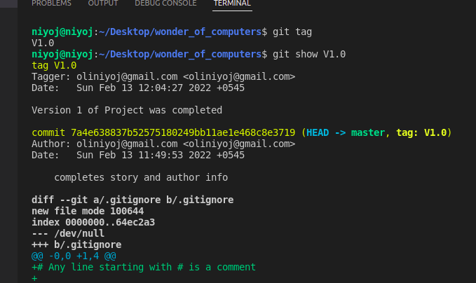
You can see information like changes made, tagger information and commiter information with the command.

## You have Completed Your Lab
Congratulations for completing this first lab. Hope that you were able to grasp some knowledge. If you have  had any doubts feel free to contact your instructor.

Further there are more resources available in this repo to know more about the above commands.

If you are participant of the workshop please do take a screenshot of your terminal after performing `git log` and upload it to the forms to verify your completion.