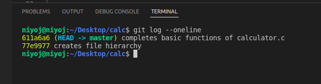
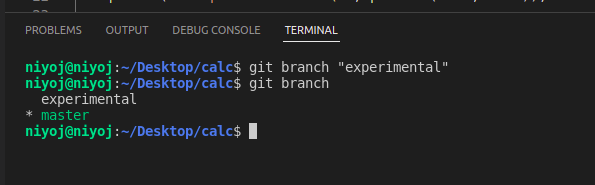
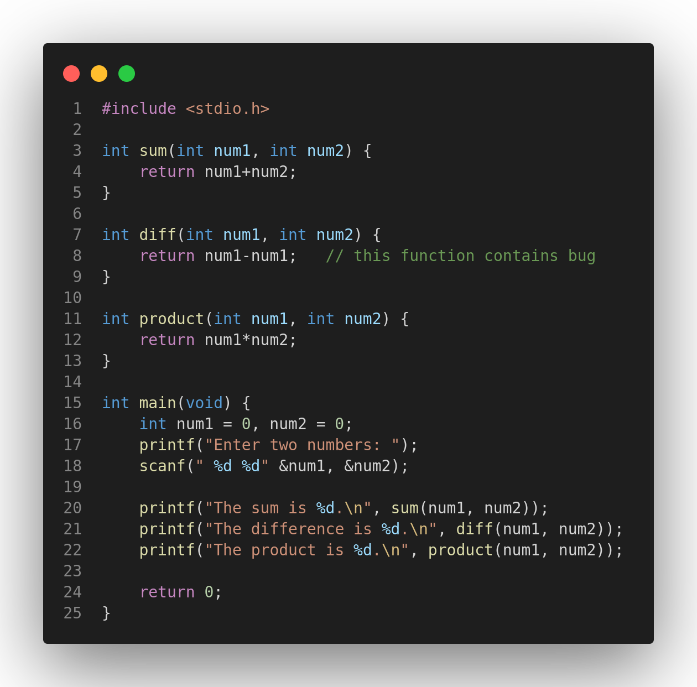
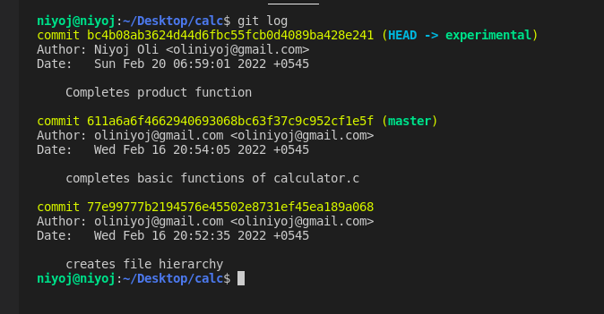
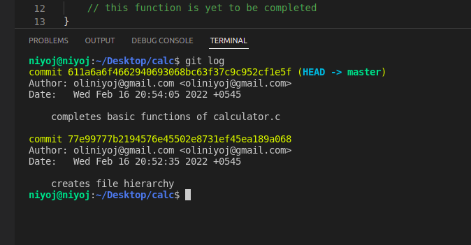
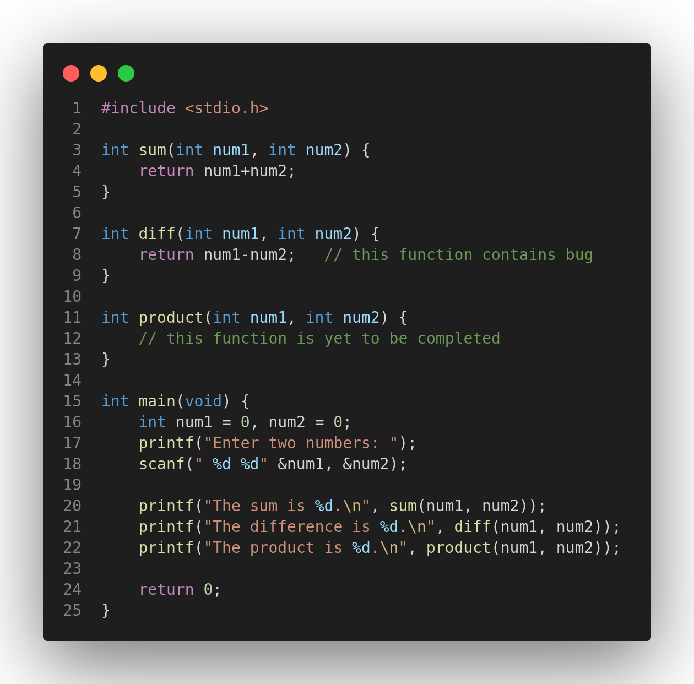
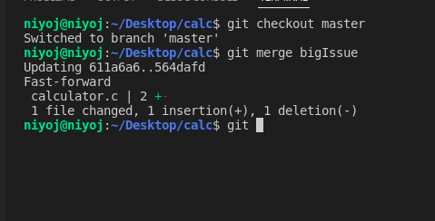
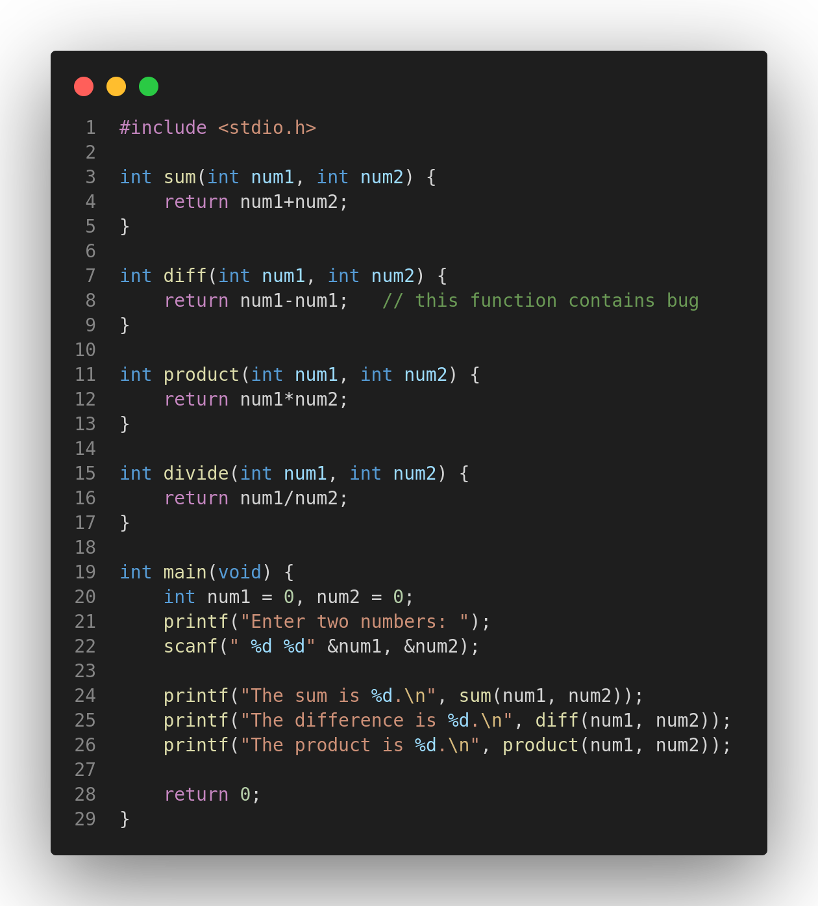
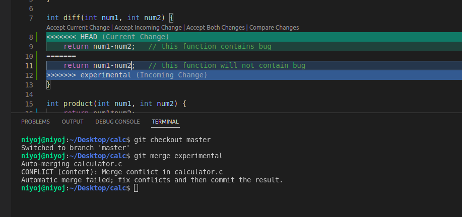

# LAB: Hanging in the Git Branches
- __Time required:__ 10 minutes
- __Pre-requisities:__ Should have completed [Lab1](./01_local_git.md),
- __Difficulty level:__ Intermediate
- __Objectives:__
    - To get familiar with Git branches,
    - To understand concept of Git branches,
    - To be familiar with Git branching workflows.

## Summary
In this lab, we wil be dealing with a scenario where we will be writing a short code and dealing with bugs that are associated with the code. 

> __Note that__: our main focus will be using Git branches to deal with removing of bugs, and creating new features so, we will not focus on code part and you can write anything in the code part.

__Suggestion__: Please follow all the steps carefully there will be some screenshots to be taken to know whether or not your lab was completed succesfully as instructed.


### Scenario
You are a famous coder of Nepal and you are planning to work on a new project __"CALCULATOR USING C PROGRAM"__. So, you planned that your folder hierarchy must look something like below;
```
.
├── calculator.c
```
Here,
- `calculator.c` file contains all the code of our project.

So, lets start our lab.

### 1. Initialization of Git repository
#### 1. Create a folder named `calc` anywhere you like and Open the folder in VS Code.
The folder will contain all the files and sub-folder as mentioned above.
#### 2. Open the terminal and initialize the Git repo using command `git init`.

### 2. Give yourself a identity \[Optional\]
This part is totally optional. If you have already made your identity no need to repeat this step. If you don't remember creating identity or want to check what identity are being saved you can use command,
```
git config --list
```

Also, if you want to change your identity or create new identity you can use command;
```
git config --global user.name "<YOUR NAME HERE>"
git config --global user.email "<YOUR EMAIL HERE>"
```
### 3. Create some commits
#### 1. Creating file strucuture
- Create a new file named `calculator.c` inside the root directory (i.e. inside `calc` folder).
- You can see the file is untracked by using command `git status`.
- Now, let's track the newly made file with the command `git add calculator.c`. This command will cause Git to start to track the file plus stages the file. 
- You can use command `git status -s` and see the file has been added to the index or has been staged.
- Finally, let's commit with the command
```bash
git commit -m "creates file hierarchy"
```

#### 2. Adding some content in `calculator.c`
- Open the file `calculator.c` and insert the following code in that file.
```c
#include <stdio.h>

int sum(int num1, int num2) {
    return num1+num2;
}

int diff(int num1, int num2) {
    return num1-num1;   // this function contains bug
}

int product(int num1, int num2) {
    // this function is yet to be completed
}

int main(void) {
    int num1 = 0, num2 = 0;
    printf("Enter two numbers: ");
    scanf(" %d %d" &num1, &num2);

    printf("The sum is %d.\n", sum(num1, num2));
    printf("The difference is %d.\n", diff(num1, num2));
    printf("The product is %d.\n", product(num1, num2));
    
    return 0;
}
```
This code contains some bugs like `return num1-num1;` should be replaced by `return num1-num2;`. Similarly, the function `product()` is incomplete. We will be using Git branches to complete the code.
- Now, stage and commit the changes made to file `calculator.c` with the command;
```bash
git commit -a -m "completes basic functions of calculator.c"
```
You can notice we have skip the staging area by the use of `-a` option. It is the shorthand command for;
```bash
git add .
git commit -m "completes basic functions of calculator.c"
```
- Use `git status` command to verify the changes have been committed and the working tree is clean.

- Use command `git log --oneline` to see the commit history in oneline. You must see the outptut similar in below picture;

- Let's see what the log tells us;
1. It shows us two commits have been made so far.
2. `(HEAD -> master)` this part means that `HEAD` is pointing to the `master` branch.

> `master` is the name of default branch created by Git. A branch is basically a movable pointer that points to a commit and always moves forward with the new commit.

> `HEAD` is another pointer that indicates in which branch we are currently on. i.e. if there are two branches named `experimental` and `master` and if head points to `master` it means the next commit will be done on master branch and the master branch pointer will move forward.

### 4. Try implementing new feature
Our code is somewhat completed so why mess with the original code. So, we create a new Git branch named `experimental` where we will try some new changes and if the changes made are bug free and does the job then only we merge the branch with the `master` branch.

> If there are two branches `master` and `experimental` then, we will have freedom that the changes done or the commit made in `master` is not dependent on `experimental` branch i.e. any changes done in `experimental` branch will not cause a change in `master` branch and if the changes are incorrect we can just delete the `experimental` branch thus, the code in `master` branch is always clean as much as possible.

#### 1. Creating a new branch
So, let's create a branch named `experimental` where we will write our `experimental` code. For this you can use the command;
```bash
git branch "experimental"
```
This will create a new branch named `experimental`.

- To see all branches present in the repo you can use the command `git branch` which will show;


Here, we can see that our repo currently has two branches `experimental` and `master` and * on master denoted that we are currently on master branch so any commits made will be made in `master` branch.

#### 2. Checkout to new branch
- So, let's checkout to the `experimental` branch. To do this, we can use command;
```bash
git checkout "experimental"
```
- Now, use the command `git branch` and you will see the asterik is on the `experimental` branch.


#### 3. Commit on new branch
- Now, let's complete the function `product()` while we are on experimental branch. Copy the code below and replace it on line number 12 where `// this function is yet to be completed` this line is written.
```c
return num1*num2;
```
Your code may look like something below;

- Now, let's stage the changes made and commit. Since you are on `experimental` branch the pointer of `experimental` branch will move foroward with the next commit while, the pointer of `master` branch will remain the same.

Use the command 
```bash
git commit -a -m "Completes product function"
```
and commit all the changes made by skipping the staging area.
- Use the command `git log` to see the commit history. 


You can see that the experimental branch has a new commit and is currently pointing `bc4b08a` commit while master branch is still on the old commit `611a6a`.
- You can use the command `git log --graph --oneline` to visualize the log with better UI.

### 5. Remove a bug
- Suddenly you realized that your program had a bug on line number 8. The line `num1-num1` doesnot makes any sense and it must be corrected as soon as possible.
- But, we have made some changes in `experimental` branch and the changes are not to be published now. So, what we can do is checkout to `master` branch create a new branch and work on the new branch. In this way, your changes in `experimental` branch would not be exposed.
- Let's go to `master` branch with the command `git checkout master`.
- If you use the command `git log` then you can see there is no third commit that was done after completing the product function. 


This is because the commits were made in experimental branch not in master branch.
- And let's create a new branch named `bigIssue` and checkout to the new branch `bigIssue`. You can use the commands;
```bash
git branch bigIssue
git checkout bigIssue
```
but alternatively we have a shorter command
```bash
git checkout -b bigIsue
```
> You can use the command `git checkout -b <New-Branch-Name>` to create a new branch and checkout to the newly created branch automatically.

- Use the command, `git branch` to see which branch are you currently on. It will show a `*` (asterik) symbol infront of the `bigIssue` branch which means you are on `bigIssue` branch.
- Now, let's remove the bug by replacing `num1-num1` with `num1-num2` on line number 8. And your code will look like below;

- Now, let's stage all the changes made and commit with the command;
```bash
git commit -a -m "fixes the issue with difference"
```
- Since, our issue has been resolved let's merge this branch in the original branch `master`.

### 6. Merge the improved code
- To merge the commits made, first checkout to the `master` branch and use the command below to merge the `bigIssue` branch with `master` branch.
```bash
git checkout master
git merge bigIssue
```
> To merge a branch to another branch (let's say to merge branchA to branchB) we first checkout to the branch where the changegs are to be merged (here branchB) and use the command `git merge branchA` to merge branchA to the branchB.

- You may notice something called `fast-forward` in the message. It is because the `bigIssue` branch was directly ahead of the `master` branch so, git simply moved the pointer of `master` branch to the `bigIssue` branch. This process is called fast-forward merge;


- Use the command `git log --oneline --graph` and do screenshot it. It will be required later on.

- Since, we donot need the `bigIssue` branch anymore, we can use the command;
```bash
git branch -d bigIssue
```
to delete the `bigIssue` branch.

### 7. Complete the feature and merge
- Now, let's add some more feature in `experimental` branch. We have decided to add a divide function. So, copy the code below and paste it on line no. 15.
```c
int divide(int num1, int num2) {
    return num1/num2;
}
```
- Also, update the comment on line no.8 to `// this function will not contain bug`. Your final code will look like this;

- Stage the changes made and commit those changes by the command;
```bash
git commit -a -m "completes divide function"
```
- Now, let's checkout to the master branch and merge the `experimental` branch to the `master` branch.
```bash
git checkout master
git merge experimental
```
- This will produce some error like `Auto-merging failed`. This is because we have two changes in two different branches in the same line and Git is unable to figure out whose changes is to be accepted. So, we must manually accept the desired changes.


- To accept the changes you can simply choose from the options `Accept Current Change` or `Accept incoming changes` or `Accept both changes`. Where, current change means the change done in `master` branch and `incoming changes` means the changes made in `experimental` branch. Click `Accept incoming changes` to accept the changes made from `experimental` branch.
- Now, if you use the command git status, you will see some merged changes are yet needed to be committed.
- Let's commit those changes with the command;
```bash
git commit -am "does merges"
```
Now, we have succesfully merged our `experimental` branch to `master` branch.

- Do screenshot after using command `git log --oneline --graph` that will be used later on.

## You have Completed Your Lab
Congratulations for completing the second lab. Hope that you were able to grasp some knowledge. If you have had any doubts feel free to contact your instructor.

Further there are more resources available in this repo to know more about the above commands.

If you are participant of the workshop please do upload all screenshots you have taken to the forms to verify your completion.
