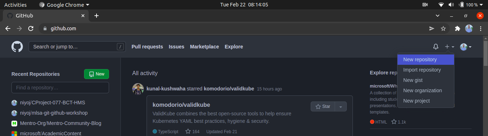
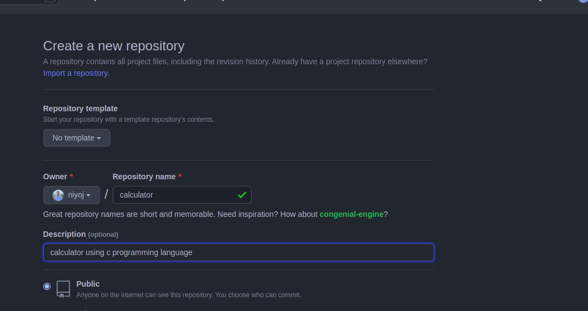
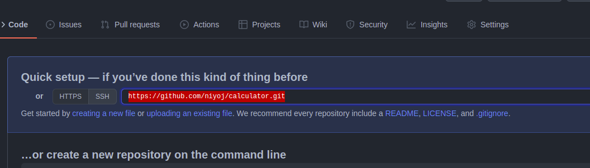
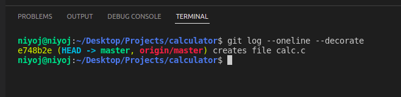
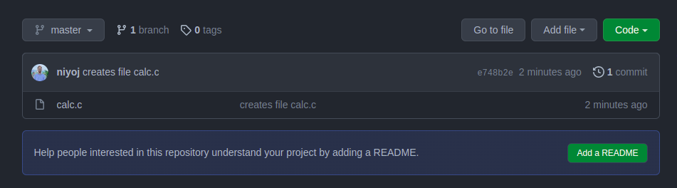
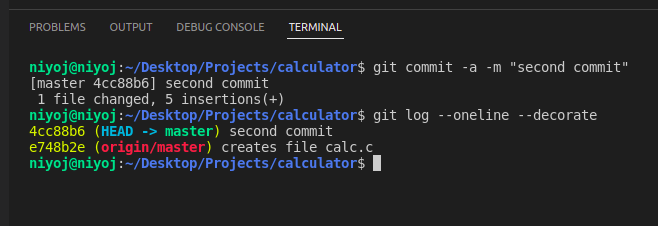
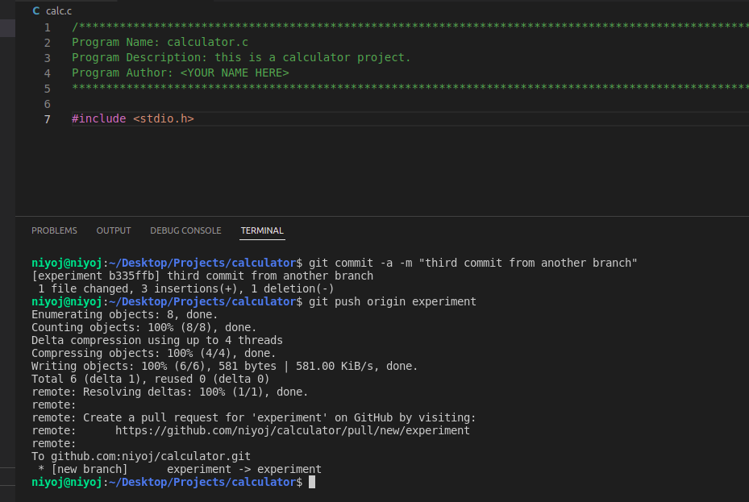
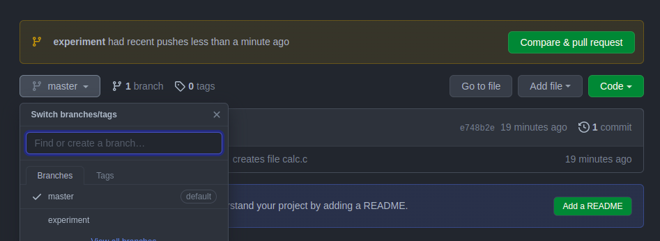
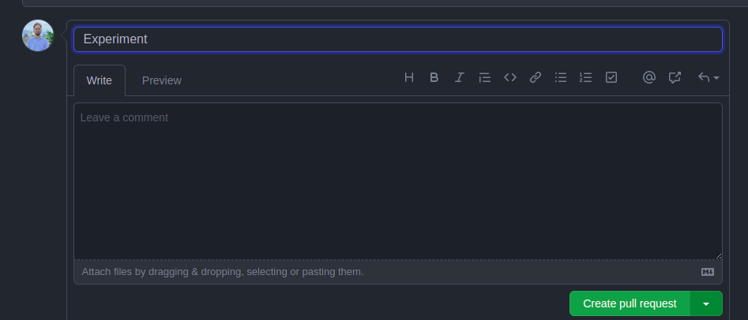
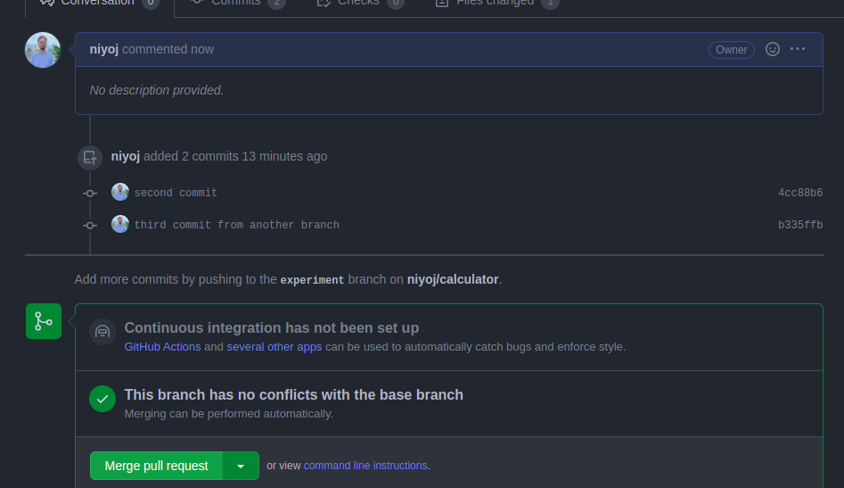

# LAB: Making Some PRs
- __Time required:__ 10 minutes
- __Pre-requisities:__ Should have completed [Lab1](./01_local_git.md), and [Lab2](./02_hanging_in_git_branches.md),
- __Difficulty level:__ Intermediate
- __Objectives:__
    - To get familiar with working with GitHub,
    - To understand concept of Git branches and utilize them in GitHub,
    - To be familiar with remote workflows.

## Summary
In this lab, we wil be dealing with a scenario where we will be writing a short code and dealing with bugs that are associated with the code. 

> __Note that__: our main focus will be using Git branches to deal with removing of bugs, and creating new features so, we will not focus on code part and you can write anything in the code part.

__Suggestion__: Please follow all the steps carefully there will be some screenshots to be taken to know whether or not your lab was completed succesfully as instructed.


### Scenario
You are a famous coder of Nepal and you are planning to work on a new project __"CALCULATOR USING C PROGRAM"__. So, you planned that your folder hierarchy must look something like below;
```
.
├── calculator.c
```
Here,
- `calculator.c` file contains all the code of our project.

So, lets start our lab.

### 1. Setting Up a GitHub Account
#### 1. Creating your GitHub account \[OPTIONAL\]
- This step is completely optional if you have already created your GitHub account.
- Visit the login page of GitHub from .
- Enter your account credentials, or choose `create an account` option to create a new account if you have not already created your account.

#### 2. Exploring GitHub UI
- You can visit your profile by clicking your avatar on the top right corner of screen and chossing the option `Your profile` from the dropdown.
- You can create `New projects`, `New repository`, `New organizations` by clicking on the `+` icon near to the avatar.

### 2. Creating a Repository in GitHub
- Goto Github and click on + icon near to your avatar. And select `New Repository` option from the dropdown.


> A repository is simply a root folder for your project where all commits will be made same as you have done in Local Git.

- Enter the name of your repository as `calculator` on `Repository Name` input field, enter the description of your repository as `calculator using c programming language` in `Description` input field.
- Now, you can choose two options from. You can either create a public repository or a private repository.
    - Public repository: Repo visible to entire GitHub community.
    - Private repository: Repo is visible only to you and you can give access to who can see the content of your repository.

> Note that whether it's a public or a private repo, only you can do some changes in your repo unless you give others the same permissions.

- Choose `public` option and click the button `Create Repository`.


### 3. Cloning the repo
- Create a new folder named `calculator` anywhere and open the folde in VS code.
- Open the terminal by clicking on `Terminal` from menubar and selecting `New Terminal` option.
- Goto your GitHub profile and copy the link as shown as below;


- Use the command
```bash
git clone <copied link here> .
```
by replacing `<copied link here>` by the link you copied earlier. and press enter.

### 4. Creating some changes
- Create a new file inside the folder `calculator` named `calc.c` which would store all our code.
- Now, let's commit the changes by using command;
```bash
git add .
git commit -m "creates file calc.c"
```
- Now, push the changes to the GitHub using command;
```
git push origin
```
- Now, use the command
```bash
git log --oneline --decorate
```
and you will see something like this;


In the log, you can see there are two branches that are currently pointing at your first commit. The first one is `master` which is a local master branch and second one is `origin/master` which is a remote tracking branch i.e. it is used to tell in which commit is our master branch of GitHub is on.

and also you will a commit added in your repo in GitHub.


- Now, let's create a one more commit. Copy and paste the content mentioned below in file `calc.c`.
```c
/********************************************************************************************************
Program Name: calculator.c
Program Description: this is a calculator project.
Program Author: <YOUR NAME HERE>
********************************************************************************************************/
```
- Stage the changes and commit with the command;
```bash
git commit -a -m "second commit"
```
- Now, use the command `git log --oneline --decorate`, you may see something like this below;


Here, you can see the `master` branch is currently pointing on the latest commit. But the branch `origin/master` has not moved. This is because the `origin/master` branch points the commit in master branch in GitHub repo. And since, we have not pushed this commit to the repo. `origin/master` is still pointing on first commit.

- Now, let's push the changes by using command;
```
git push origin
```
### Pushing the changes from another branch
- Now, let's create a new branch with the command
```
git branch experiment
git checkout experiment
```
This will create a new branch and checkout to the new branch `experiment`.
- Now, let's add some content in the code. Copy and paste the code below;
```
#include <stdio.h> //from experiment branch
```
- Now, stage and commit the changes,
```
git commit -a -m "third commit from another branch"
```
- Now, push the changes from experiment branch
```
git push origin experiment
```


- Now, open the repo in GitHub and you will see that there are two branches and `experiment` branch have one more commit than `master` branch.


- Now, click on `Compare & Pull Request` button.


- Now, click on `create pull request button`.

- Click on `merge pull request` button and click `confirm merge`. This will merge `experiment` and `master` branch on GitHub so, the changes made in `experiment` branch is also in the `master` branch.

### Pulling the changes
- First, checkout to `master` branch with the command `git checkout master`.
- And use command `git log --oneline --decorate`. You can see that it doesnot contain the commits we created earlier in `experiment` branch, although we have merged `master` and `experiment` branch together. This is because we have not yet downloaded the changes after it was merged.
- To download the changes, use the command
```
git pull origin
```
This command will download the content from origin or your repository in GitHub.
- Use command `git log --oneline --decorate` and you will see all the changes reflected in your local repository.
- Do screenshot after using command `git log --oneline --graph --decorate` that will be used later on.

## You have Completed Your Lab
Congratulations for completing the third lab. Hope that you were able to grasp some knowledge. If you have had any doubts feel free to contact your instructor.

Further there are more resources available in this repo to know more about the above commands.

If you are participant of the workshop please do upload all screenshots you have taken to the forms to verify your completion.