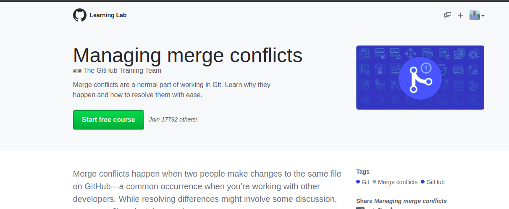
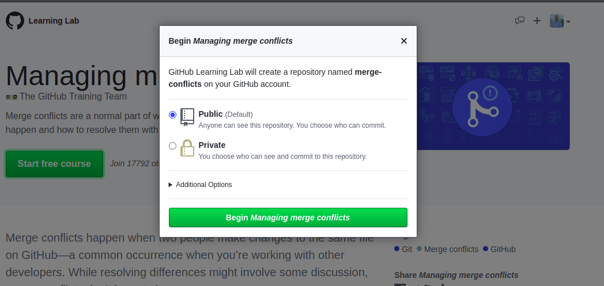
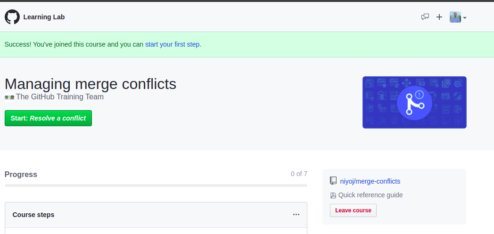
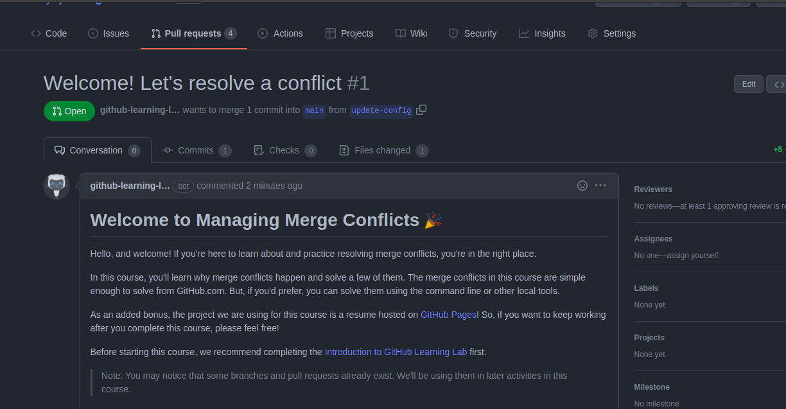
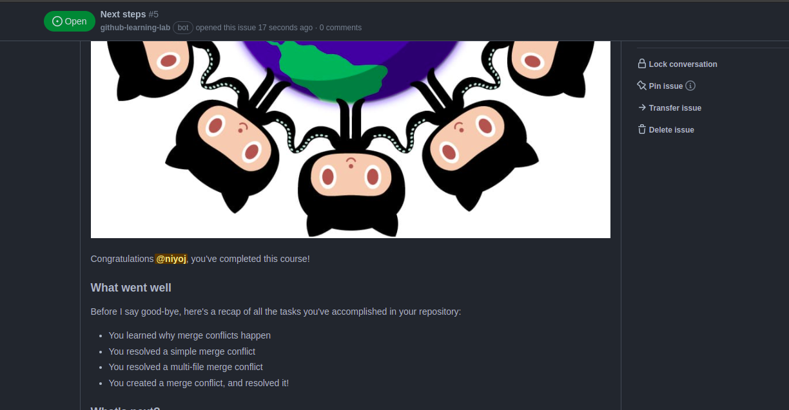

# LAB: Starting a GitHub Project
- __Time required:__ 2 Hourse
- __Pre-requisities:__ Should have completed [Lab3](./03_making_PRs.md), Should be able to work with local Git
- __Difficulty level:__ Intermediate
- __Objectives:__
    - To get familiar with starting a GitHub project,
    - To get familiar with maintainging a GitHub project.

## Summary
In this lab, you will be performing 4 official labs by GitHub where you will learn to;
- Manage merge conflicts,
- Get familiar with MarkDown,
- Review pull requests, and,
- Starting a GitHub project.

So, let's start the lab for today;

### Managing Merge Conflicts
- Go to the GitHub Learning Lab from [this link](https://lab.github.com/githubtraining/managing-merge-conflicts).
- Click the `Start Free Course` section. 

- If asked for login credentials, enter your login details.
- Then, a dialog box like below will appear,

In this lab, a new GitHub repository will be created where all the actions are needed to be done. If you need that repository to be private, choose the private option or else public option also doesn't really matters.
- Wait for sometime. If any error message occurse like `failed to initialize the repo` repeat the above steps again.
- Then, you may see something like this;

Click on the `Start: Resolve a conflict` button and you are good to go.
- You may see that you are in a repository. And your interface might look like something below;

Read all the instructions carefully and complete the lab.
- After completion of the lab, you will see something like this;

Do take the screenshot, it will be used later on.

### Communicating Using Markdown
- Goto the GitHub Learning Lab from [this link](https://lab.github.com/githubtraining/communicating-using-markdown).
- And repeat the same step as done above.
- Finally, take the screenshot once it is completed. 

### Community starter kit
- Goto the GitHub Learning Lab from [this link](https://lab.github.com/githubtraining/community-starter-kit).
- And repeat the same step as done above.
- Finally, take the screenshot once it is completed. 

### Reviewing pull requests
- Goto the GitHub Learning Lab from [this link](https://lab.github.com/githubtraining/reviewing-pull-requests).
- And repeat the same step as done above.
- Finally, take the screenshot once it is completed. 

## You have Completed Your Lab
Congratulations for completing the second lab. Hope that you were able to grasp some knowledge. If you have had any doubts feel free to contact your instructor.

Further there are more resources available in this repo to know more about the above commands.

If you are participant of the workshop please do upload all screenshots you have taken to the forms to verify your completion.